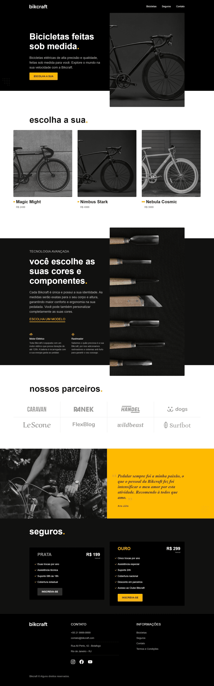

# Bikcraft

## Access Project

- https://bikcraft-tales-camelo.netlify.app/

## 📃 About The Project

- Bikcraft is a company that sells custom made-to-measure bicycles.
- It is a responsive website, adaptable to smartphones and tablets, in which the JavaScript used in the front end was responsible for bringing some features, such as navigable slides, for example.

## Tools

- HTML5
- CSS3
- JavaScript

# Bikcraft-Tales
